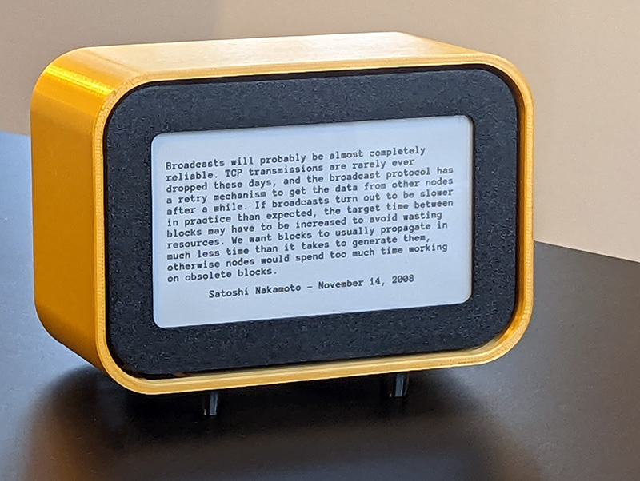
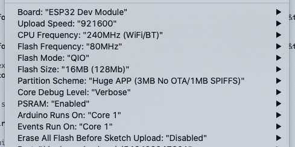

# Gerty - Your Bitcoin Assistant

Gerty, a Bitcoin Assistant controlled from your LNbits wallet.

Build your own Gerty or buy a [pre-assembled Gerty from the LNbits shop](https://shop.lnbits.com/product/gerty-a-bitcoin-assistant).

What does Gerty show?

+ Current block height
+ A list of Satoshi's quotes from bitcointalk.org
+ Your LNbits wallet balance
+ An onchain dashboard
+ A lightning dashboard
+ A mining dashboard
+ Current Bitcoin price in your preferred currency
+ Website status check
+ Mempool fees [coming soon]
+ Samourai Whirlpool dashboard [coming soon]

## Parts List

+ [LilyGo 4.7 EPD](http://www.lilygo.cn/prod_view.aspx?TypeId=50061&Id=1384&FId=t3:50061:3)
  + Also available [on Amazon](https://www.amazon.com/LILYGO-T5-4-7-Version-Bluetooth-arduino/dp/B09FSLKB9Q)
+ [Switch](https://www.amazon.co.uk/gp/product/B00OK9FAUW/)
+ A 3.7v, 1000mah or 2000mah LiPo battery
+ [3D printed case](enclosure/)
+ M2.5 3.2mm diameter heat set inserts and screws
+ [A 90 degree USB-C adapter](https://www.amazon.co.uk/Downward-Extension-Compatible-Microsoft-Nintendo/dp/B07JKBKM12/)

## Operating Instructions

+ Hold the button on the top of Gerty whilst powering on to launch the configuration access point
+ Tap the button on top of Gerty to refresh Gerty's display

## Build Instructions

+ Clone the Gerty repository to your computer
  + `git clone https://github.com/lnbits/gerty-hardware.git`
+ Install Arduino IDE v2.x
  + Follow the official docs [here](https://docs.arduino.cc/software/ide-v2/tutorials/getting-started/ide-v2-downloading-and-installing)
+ Copy the entire `libraries` directory to your Arduino Sketchbook directory
  + The default directory can be found under `Files > Preferences > Sketchbook Location` in the Arduino IDE settings
+ Launch Arduino IDE
+ Open the Gerty project in Arduino IDE
  + Select `File > Open` and then double-click the `gerty.ino` file in `gerty/`
+ Install the ESP32 boards in Arduino IDE
  + Go to `File > Preferences`
  + Paste the following URL in the `Additional Boards Manager` URL field
    + `https://raw.githubusercontent.com/espressif/arduino-esp32/gh-pages/package_esp32_index.json`
  + Open the Boards Manager at `Tools > Board > Boards Manager`
  + Search for `esp32` and install `esp32 by Espressif Systems`
+ If you're on Linux, grant Arduino IDE access to USB serial via the following command
  + `sudo usermod -a -G dialout $USER`
+ Connect the LilyGo EPD to computer
+ Select the board in the dropdown at the top, and search for "ESP32 Dev Module", select it, and hit OK
+ Check that your `Arduino > Tools` settings match these values

+ Upload the Sketch to your board `Sketch > Upload`
  + This will take a bit of time as the firmware is compiled on your computer and then uploaded and installed
  + Gerty should boot up to a QR code with Wifi information after a bit
+ Create an lnbits wallet and install the Gerty extension
  + Go to `Manage Extensions` and hit `Manage` on Gerty
  + Keep opening drop-downs until you see `Install`
+ Enable the Gerty extension and then click `Manage`
+ Create a new Gerty and configure your Gerty options
+ Click this button and then click the Gerty API URL to copy the text to your clipboard

+ Connect to AP - Password `ToTheMoon1`
+ The Gerty Captive Portal page should appear in a web browser, if it doesn't open a web browser and navigate to [http://6.15.6.16/](http://6.15.6.16/)
+ Click on the `Gerty Settings` tab and paste the copied API URL into the API URL field. Click `Save`
+ Click on the `Configure new AP` tag, select an access point, enter the AP's passphrase and click `Apply`
+ If you have printed a case for Gerty, place your Gerty into the printed enclosure
+ Bask in the glory of Gerty!
